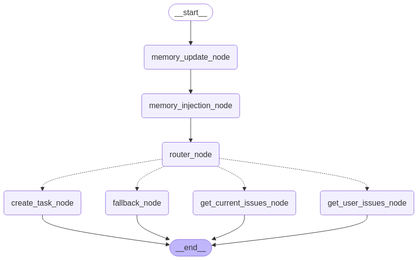

<h1 align="center">
   Linear Agent
</h1>

<p align="center">
  Turning conversations into Linear tickets, one chat at a time
</p>

<p align="center">
  
  
  
  
</p>

## What happens when LangGraph meets Linear? 🤔

You get **Linear Agent**, a chat-based assistant that talks to your Linear account and manages tasks without the hassle of switching contexts. Want to create a ticket while deep in conversation with your team? Just ask the agent. Need to check what's still on your plate for today? Ask away.

No more context switching between chat and Linear. No more "I'll add that to Linear later" moments that never happen. Just fluid, natural task management that feels like talking to a really organized friend.

https://github.com/user-attachments/assets/a9cc8de3-f44a-4c46-b446-4668a9dc59b8
<div align="center">
    <video src="https://github.com/user-attachments/assets/a9cc8de3-f44a-4c46-b446-4668a9dc59b8" controls width="100%"></video>
</div>

## Why this actually matters

Traditional project management requires you to interrupt your workflow, navigate to another app, fill out forms, and switch contexts completely - a massive productivity killer.

Linear Agent flips this on its 

head. It lets you:

- **Stay where you are** - Create tickets without ever leaving your conversation
- **Use human language** - "Create a task to fix the login bug" just works
- **Keep your context** - The agent remembers what you've been talking about
- **Get real-time updates** - Check task status without opening Linear

It's like having a really efficient team member whose only job is to manage your Linear account.

## A Reference Implementation for LangGraph Best Practices

This project was built specifically to demonstrate LangGraph best practices and provide a real-world reference implementation. It showcases:

- **Optimal Graph Structure** - How to design clean, maintainable graph workflows
- **Proper Node Separation** - Organizing specialized nodes with clear responsibilities
- **State Management Patterns** - Implementing robust conversation state handling
- **Edge Logic Design** - Creating intelligent routing between workflow steps
- **Project Organization** - Folder structure that scales with complexity
- **Memory Integration** - Practical implementation of conversation memory
- **API Integration Patterns** - Clean separation between LLM logic and external APIs

Whether you're learning LangGraph or looking to structure your own agent-based applications, this codebase provides patterns you can adapt and build upon.

This project draws inspiration from [Ava WhatsApp Agent](https://github.com/neural-maze/ava-whatsapp-agent-course).

## How to get started

### You'll need:

- Python 3.9+ (tested on 3.9 and 3.10)
- A Linear account with API access
- A Google Generative AI API key (or swap in your preferred LLM)

### Quick setup:

1. **Get the code**
   ```bash
   git clone https://github.com/maxxxara/linear-agent.git
   cd linear-agent
   ```

2. **Create your environment**
   ```bash
   python -m venv venv
   source venv/bin/activate  # On Windows: venv\Scripts\activate
   pip install -r requirements.txt
   ```

3. **Set up your secrets**
   Create a `.env` file with these variables:
   ```
   LINEAR_API_KEY=your_linear_api_key
   LINEAR_TEAM_NAME=your_team_name
   GOOGLE_API_KEY=your_google_api_key
   ```

4. **Fire it up**
   ```bash
   python run_streamlit.py
   ```

That's it! Your agent is alive and ready to chat about tasks.

## How it actually works

Linear Agent isn't magic (though it sometimes feels like it). Here's what's happening behind the scenes:

### Under the hood

The agent uses a LangGraph workflow that looks like this:



This agentic approach means the agent can make decisions about how to help you rather than just following rigid commands.

### Graph Workflow Nodes

The LangGraph workflow consists of several specialized nodes:

- **__start__** and **__end__**: Entry and exit points of the conversation flow
- **Memory Nodes**:
  - **memory_update_node**: Updates the conversation memory with new messages
  - **memory_injection_node**: Retrieves relevant context from previous conversations
- **router_node**: Analyzes the user's intent and directs the conversation to the appropriate action
- **Linear Action Nodes**:
  - **create_task_node**: Handles the creation of new tickets in Linear
  - **get_current_issues_node**: Retrieves and formats all current issues from Linear
  - **get_user_issues_node**: Fetches issues assigned to a specific user
- **fallback_node**: Handles general conversation when no specific Linear action is needed

The workflow first processes memory, then determines the user's intent, and finally executes the appropriate Linear action or continues the conversation.

## Let's see it in action

Here's what chatting with Linear Agent looks like in real life:

### Creating a task on the fly

```
You: We need to fix that login bug that keeps popping up
Agent: That sounds important. Should I create a ticket for it?
You: Yeah, please do
Agent: Created "Fix recurring login bug" in the Todo state. Want me to assign it to anyone specific?
```

### Getting your tasks when you're overwhelmed

```
You: I've lost track of what I'm supposed to be doing today
Agent: No problem! Here are your current tasks:
     🔵 Implement dark mode - In Progress
     ⚪ Update API documentation - Todo
     ⚪ Refactor auth service - Todo
     ✅ Fix navigation bug - Done
```

### Checking what your colleague is up to

```
You: What's Alex working on right now?
Agent: Alex has these tasks assigned:
     🔵 Redesign landing page - In Progress
     🔵 Create new logo variants - In Progress
     ⚪ Update color palette - Todo
```

## The tech that makes it tick

- **LangGraph** - Orchestrates the whole conversation flow
- **LangChain** - Handles the LLM interactions 
- **Streamlit** - Provides a simple chat interface
- **Linear API** - Connects to your Linear workspace
- **Google Generative AI** - Powers the language understanding (but you can swap this out)
- **Chroma** - Stores conversation memory as vector embeddings

## Exploring the code

If you want to dive into the code or contribute, here's how things are organized:

```
linear-agent/
├── src/                      # All the real code lives here
│   ├── app.py                # The Streamlit interface
│   ├── graph/                # LangGraph magic happens here
│   │   ├── graph.py          # The workflow definition
│   │   ├── nodes.py          # Individual workflow steps
│   │   ├── edges.py          # Decision logic between steps
│   │   └── state.py          # Conversation state management
│   ├── modules/              # The specialized components
│   │   ├── linear/           # All the Linear API magic
│   │   └── memory/           # Conversation memory system
├── run_streamlit.py          # Quick launcher
├── requirements.txt          # Dependencies
└── .env                      # Your secrets (not in repo)
```

## Want to contribute?

I'd love your help making Linear Agent even better! Here's how:

1. Fork the repo
2. Create a branch (`git checkout -b add-amazing-feature`)
3. Make your changes
4. Commit (`git commit -m 'Add this cool new feature'`)
5. Push to your branch (`git push origin add-amazing-feature`)
6. Open a Pull Request

Bugs, features, docs improvements - all contributions welcome!

## License & Credits

This project is free to use under the MIT License.

Big thanks to:
- The LangGraph team for building such an amazing workflow engine
- Linear for their excellent API
- Everyone working on making LLMs more accessible

## Useful links

- [Linear API docs](https://developers.linear.app/docs/)
- [LangGraph guides](https://langchain-ai.github.io/langgraph/)
- [Streamlit tutorials](https://docs.streamlit.io/)

---

<p align="center">
  Built while procrastinating on actual tickets in Linear 😅
</p>
